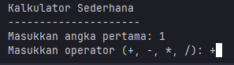

<a id="readme-top"></a>

[![Contributors][contributors-shield]][contributors-url]
[![Forks][forks-shield]][forks-url]
[![Stargazers][stars-shield]][stars-url]
[![Issues][issues-shield]][issues-url]
[![Unlicense License][license-shield]][license-url]

<br />
<div align="center">
  <a href="https://github.com/kittendev/simple-calculator">
    
  </a>

<h3 align="center">Simple Java Calculator</h3>

  <p align="center">
    Sebuah aplikasi kalkulator sederhana yang ditulis dalam bahasa pemrograman Java.
    <br />
    <a href="https://kittendev.github.io/simple-calculator/"><strong>Explore the docs »</strong></a>
    <br />
    <br />
  </p>
</div>


<!-- TABLE OF CONTENTS -->
<details>
  <summary>Table of Contents</summary>
  <ol>
    <li>
      <a href="#about-the-project">About The Project</a>
      <ul>
        <li><a href="#built-with">Built With</a></li>
        <li><a href="#project-structure">Project Structure</a></li>
      </ul>
    </li>
    <li>
      <a href="#getting-started">Getting Started</a>
      <ul>
        <li><a href="#prerequisites">Prerequisites</a></li>
        <li><a href="#installation">Installation</a></li>
      </ul>
    </li>
    <li><a href="#usage">Usage</a></li>
    <li><a href="#contributing">Contributing</a></li>
    <li><a href="#license">License</a></li>
    <li><a href="#contact">Contact</a></li>
    <li><a href="#acknowledgments">Acknowledgments</a></li>
  </ol>
</details>

<!-- ABOUT THE PROJECT -->
## About The Project

[![Product Name Screen Shot][product-screenshot]](https://example.com)

Simple Java Calculator adalah aplikasi kalkulator sederhana yang ditulis dalam bahasa pemrograman Java.
Aplikasi ini dibuat sebagai proyek pembelajaran untuk memahami konsep unit testing dalam pengujian perangkat lunak.
Aplikasi ini memiliki antarmuka CLI yang sederhana dan mendukung operasi dasar seperti penjumlahan, pengurangan, perkalian, dan pembagian.

<p align="right">(<a href="#readme-top">back to top</a>)</p>


### Built With

* [![Java][Java.com]][Java-url]
* [![JUnit][JUnit.com]][JUnit-url]
* [![Gradle][Gradle.com]][Gradle-url]
* [![IntelliJ IDEA][IntelliJ.com]][IntelliJ-url]

<p align="right">(<a href="#readme-top">back to top</a>)</p>


### Project Structure
```
├── src
│   ├── main
│   │   ├── java
│   │   │   └── org.a9.calculator
│   │   │       ├── Calculator.java
│   │   │       ├── ConsolePrinter.java
│   │   │       ├── InputValidator.java
│   │   │       └── Main.java
│   │   └── resources
│   │       └── (Kosong / optional resources)
│
│   └── test
│       ├── java
│       │   └── org.a9.calculator
│       │       ├── CalculatorAddTest.java
│       │       ├── CalculatorDivideTest.java
│       │       ├── CalculatorMultiplyTest.java
│       │       ├── CalculatorSubtractTest.java
│       │       ├── CalculatorTest.java
│       │       ├── ConsolePrinterPrintErrorTest.java
│       │       ├── ConsolePrinterPrintResultTest.java
│       │       ├── ConsolePrinterPrintWelcomeMessageTest.java
│       │       ├── InputNumberValidatorTest.java
│       │       ├── InputOperatorValidatorTest.java
│       │       └── MainTest.java
│       └── resources
│           └── (Kosong / optional test resources)
├── build.gradle.kts
├── gradlew
├── gradlew.bat
├── settings.gradle.kts
├── LICENSE.txt
└── README.md
```


<!-- GETTING STARTED -->
## Getting Started

Ini adalah panduan singkat untuk memulai proyek ini.
Untuk mendapatkan salinan proyek ini, ikuti langkah-langkah berikut:

### Prerequisites
Sebelum memulai, pastikan Anda telah menginstal perangkat lunak berikut:
* Java Development Kit (JDK) versi 23 atau yang lebih baru <br>
  Untuk memeriksa versi JDK yang terinstal, jalankan perintah berikut di terminal:
   ```sh
   java -version
   ```
  Jika Anda belum menginstal JDK, Anda dapat mengunduhnya dari [Java SE DK 23 Downloads](https://www.oracle.com/java/technologies/javase/jdk23-archive-downloads.html).

### Installation
1. Clone repo ini ke mesin lokal Anda menggunakan perintah berikut:
   ```sh
   git clone https://github.com/kittendev/simple-calculator
    ```
2. Masuk ke direktori proyek:
   ```sh
   cd simple-calculator
   ```
3. Jalankan perintah berikut untuk mengunduh dependensi yang diperlukan dan membangun proyek:
   ```sh
   ./gradlew clean build
   ```
4. Setelah proses build selesai, Anda dapat menjalankan aplikasi dengan perintah berikut:
   ```sh
    java -jar build/libs/simple-calculator-1.0-SNAPSHOT.jar
   ```
5. Untuk menjalankan unit test, gunakan perintah berikut:
   ```sh
    ./gradlew test
    ```
6. Anda juga dapat menjalankan unit test untuk kelas tertentu dengan perintah berikut:
   ```sh
    ./gradlew test --tests <test_class_name>
   ```
    Gantilah `<test_class_name>` dengan nama kelas yang ingin Anda uji.
    Contoh untuk menguji kelas `CalculatorSubtractTest`:
   ```sh
    ./gradlew test --tests CalculatorSubtractTest
   ```
   
<p align="right">(<a href="#readme-top">back to top</a>)</p>

<!-- USAGE EXAMPLES -->
## Usage
Untuk menggunakan aplikasi kalkulator ini, ikuti langkah-langkah berikut:
1. Jalankan aplikasi dengan perintah yang telah dijelaskan di bagian [Installation](#installation). <br>
   
2. Masukkan angka pertama yang ingin Anda hitung. Kemudian tekan enter <br>
   
3. Masukkan operator yang ingin Anda gunakan. Kemudian tekan enter <br>
    
    Tersedia operator berikut:
    - `+` untuk penjumlahan
    - `-` untuk pengurangan
    - `*` untuk perkalian
    - `/` untuk pembagian
4. Masukkan angka kedua yang ingin Anda hitung. Kemudian tekan enter <br>
   
5. Hasil perhitungan akan ditampilkan di layar. <br>
   
6. Untuk menghentikan aplikasi, tekan `CTRL + C` pada keyboard Anda. <br>

Anda juga dapat menjalankan unit test untuk memastikan bahwa aplikasi berfungsi dengan baik. Untuk informasi lebih lanjut, lihat bagian [Installation](#installation).


<p align="right">(<a href="#readme-top">back to top</a>)</p>


<!-- CONTRIBUTING -->
## Contributing
Jika Anda ingin berkontribusi pada proyek ini, silakan ikuti langkah-langkah berikut:
1. Fork proyek ini
2. Buat fitur baru atau perbaikan bug
3. Lakukan commit perubahan Anda
4. Buat pull request ke cabang utama proyek ini
5. Pastikan untuk mengikuti pedoman kontribusi yang baik dan menjelaskan perubahan yang Anda buat

### Top contributors:
<a href="https://github.com/kittendev/simple-calculator/graphs/contributors">
  
</a>

<p align="right">(<a href="#readme-top">back to top</a>)</p>

<!-- LICENSE -->
## License
Distributed under the MIT License. See `LICENSE.txt` for more information.

<p align="right">(<a href="#readme-top">back to top</a>)</p>

<!-- CONTACT -->
## Contact
Kittendev - [@ssparkle](https://discord.com/) <br>
firmanzz - [@firman7343](https://discord.com/) <br>
hanssip15 - [@kitsuwa15](https://discord.com/) <br>

Project Link: [https://github.com/kittendev/simple-calculator](https://github.com/kittendev/simple-calculator)

<p align="right">(<a href="#readme-top">back to top</a>)</p>


<!-- ACKNOWLEDGMENTS -->
## Acknowledgments
* [Gradle](https://gradle.org/)
* [JUnit](https://junit.org/junit5/)
* [Java](https://www.java.com/)
* [OpenJDK](https://openjdk.org/)
* [Java SE DK 23](https://www.oracle.com/java/technologies/javase/jdk23-archive-downloads.html)

<!-- MARKDOWN LINKS & IMAGES -->
[contributors-shield]: https://img.shields.io/github/contributors/kittendev/simple-calculator.svg?style=for-the-badge
[contributors-url]: https://github.com/kittendev/simple-calculator/graphs/contributors
[forks-shield]: https://img.shields.io/github/forks/kittendev/simple-calculator.svg?style=for-the-badge
[forks-url]: https://github.com/kittendev/simple-calculator/network/members
[stars-shield]: https://img.shields.io/github/stars/kittendev/simple-calculator.svg?style=for-the-badge
[stars-url]: https://github.com/kittendev/simple-calculator/stargazers
[issues-shield]: https://img.shields.io/github/issues/kittendev/simple-calculator.svg?style=for-the-badge
[issues-url]: https://github.com/kittendev/simple-calculator/issues
[license-shield]: https://img.shields.io/github/license/kittendev/simple-calculator.svg?style=for-the-badge
[license-url]: https://github.com/kittendev/simple-calculator/blob/master/LICENSE
[product-screenshot]: images/screenshot.png
[Java.com]: https://img.shields.io/badge/Java-%23ED8B00.svg?logo=openjdk&logoColor=white
[Java-url]: https://www.java.com
[JUnit.com]: https://img.shields.io/badge/JUnit-25A162.svg?logo=junit5&logoColor=white
[JUnit-url]: https://junit.org/junit5/
[Gradle.com]: https://img.shields.io/badge/Gradle-02303A.svg?logo=gradle&logoColor=white
[Gradle-url]: https://gradle.org/
[IntelliJ.com]: https://img.shields.io/badge/IntelliJ_IDEA-000000.svg?logo=intellijidea&logoColor=white
[IntelliJ-url]: https://www.jetbrains.com/idea/
